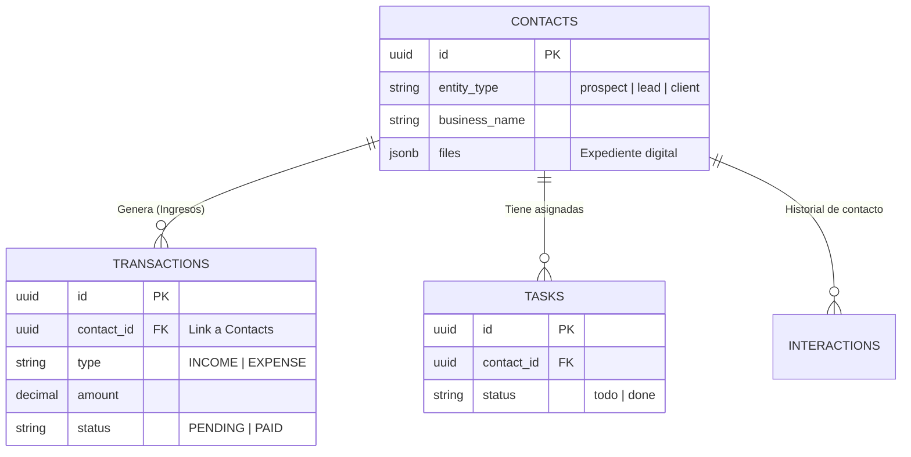

# 🏗️ Documentación Técnica de Datos: CRM Objetivo V2

*[Generado automáticamente por Antigravity tras Auditoría de Base de Datos - 25 Dic 2024]*

Este documento detalla la estructura de datos, las relaciones entre módulos y los flujos de "verdad" dentro del CRM. Es vital para entender cómo se comunican Discovery, Ventas y Finanzas.

---

## 1. Arquitectura Central: "Contacts" (Tabla Unificada)
El cambio más importante en V2 es la unificación de Prospectos, Leads y Clientes en una sola tabla maestra.

**Tabla:** `public.contacts`
*   **Identificador Único:** `id` (UUID de Supabase).
*   **Discriminador:** Columna `entity_type` ('prospect', 'lead', 'client').
*   **Ciclo de Vida:** Un registro empieza como 'prospect', puede pasar a 'lead' y finalmente a 'client' *sin cambiar de ID*.
*   **Datos Críticos:**
    *   `business_name`, `contact_name` (Identificadores humanos).
    *   `files` (Array JSON): Almacena rutas a PDFs, Fotos, etc.

> **⚠️ Nota para Desarrolladores:** No busques tablas separadas llamadas `prospects` o `leads` para datos nuevos. Todo vive en `contacts`.

---

## 2. Relación con Finanzas ("Money Trail")

El módulo financiero NO es un silo aislado. Se alimenta de la actividad operativa.

**Tabla:** `public.transactions`
*   **Relación Clave:** Columna `contact_id` (Foreign Key -> `contacts.id`).
    *   *Antes (V1):* Se usaba `client_id` apuntando a una tabla obsoleta.
    *   *Ahora (V2):* Todas las transacciones (Ingresos o Gastos) se ligan al UUID único de `contacts`.
*   **Flujo de Cobranza:**
    1.  Se crea una transacción tipo `INCOME` con estado `PENDING`.
    2.  El campo `dueDate` determina la alerta de cobranza.
    3.  Al marcarse como `PAID`, el sistema suma este monto al "Valor de Vida" (LTV) del contacto asociado.

---

## 3. Módulo Discovery & Leads (Flujo de Entrada)
El proceso de prospección genera datos que eventualmente se monetizan.

*   **Tabla de Entrada:** `discovery_leads` (Datos crudos de scraping/importación).
*   **Conversión:** Cuando un `discovery_lead` es calificado, se inserta en `contacts` (con `entity_type: 'lead'`).
*   **Datos Ricos:** La IA ("Cortex") rellena campos cualitativos en `contacts` como:
    *   `strengths`, `weaknesses` (FODA).
    *   `personality_type` (Psicografía).
    *   `pain_points` ( Dolores cuantificados).

---

## 4. Mapa de Tablas y Relaciones (ERD Simplificado)

## 5. Notas de Seguridad y Auditoría
*   **Row Level Security (RLS):** Activado en todas las tablas. Los usuarios solo ven lo que su `auth.uid()` permite.
*   **Claves de API:** El frontend usa la `ANON_KEY`. Operaciones privilegiadas (como migraciones masivas) requieren `SERVICE_ROLE_KEY` (solo backend scripts).
