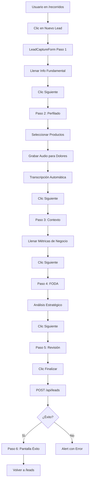
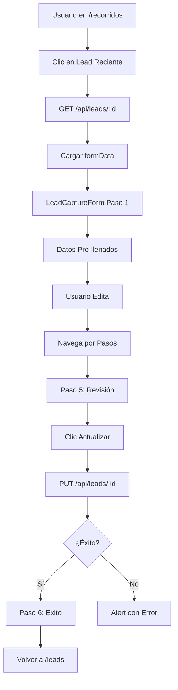
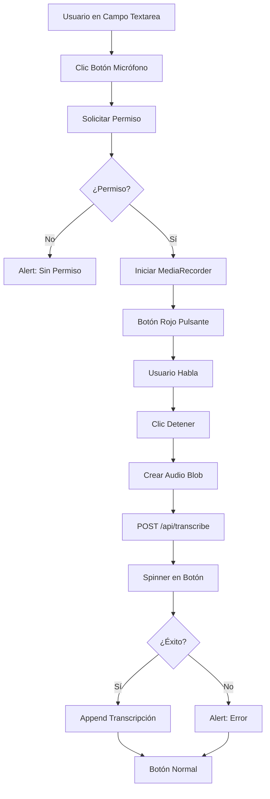

# Manual Técnico - Módulo Recorridos (Visitas de Campo)

## 📋 Visión General

### Propósito
El módulo **Recorridos** es una herramienta de captura de información de leads durante visitas comerciales en campo. Diseñado para vendedores y representantes comerciales que necesitan registrar datos completos de prospectos de manera rápida y eficiente, incluso en movimiento.

### Características Clave
- **Formulario multi-paso**: 6 secciones organizadas para captura progresiva
- **Transcripción de voz**: Grabación y conversión automática de audio a texto
- **Selector de productos**: Selección múltiple de productos/servicios de interés
- **Análisis FODA**: Framework estratégico integrado
- **Modo edición**: Continuar expedientes en progreso
- **Diseño mobile-first**: Optimizado para uso en campo

---

## 🏗️ Arquitectura Técnica

### Estructura de Archivos

```
app/recorridos/
└── page.tsx                          # Página wrapper (7 líneas)

components/recorridos/
├── recorridos-layout.tsx             # Layout principal (140 líneas)
├── lead-capture-form.tsx             # Formulario multi-paso (453 líneas)
└── multi-product-selector.tsx        # Selector de productos
```

### Flujo de Navegación

```
/recorridos
    ↓
RecorridosLayout (Dashboard)
    ↓
    ├─→ Nuevo Lead → LeadCaptureForm (modo creación)
    └─→ Continuar Lead → LeadCaptureForm (modo edición, leadId)
        ↓
        6 Pasos de Captura
        ↓
        POST /api/leads (crear) o PUT /api/leads/{id} (actualizar)
        ↓
        Pantalla de Éxito
        ↓
        Volver a /leads
```

### API Endpoints Utilizados

#### `GET /api/leads/{id}`
**Propósito**: Cargar datos de un lead existente para edición

**Respuesta**:
```typescript
{
  businessName: string;
  contactName: string;
  phone: string;
  email: string;
  // ... 30+ campos más
}
```

#### `POST /api/leads`
**Propósito**: Crear nuevo lead

**Payload**: Objeto `formData` completo (ver sección Modelo de Datos)

#### `PUT /api/leads/{id}`
**Propósito**: Actualizar lead existente

**Payload**: Mismo que POST

#### `POST /api/transcribe`
**Propósito**: Transcribir audio a texto usando Whisper API

**Payload**: `FormData` con archivo de audio
```typescript
formData.append("audio", audioBlob, "recording.wav")
```

**Respuesta**:
```typescript
{
  transcription: string;
}
```

---

## 📊 Modelo de Datos

### Interfaz `formData`

El formulario maneja **32 campos** organizados en 4 categorías:

#### **Paso 1: Información Fundamental**
```typescript
{
  businessName: string;           // Nombre del negocio
  contactName: string;            // Nombre del contacto
  phone: string;                  // Teléfono
  email: string;                  // Email
  address: string;                // Dirección física
  businessLocation: string;       // Ubicación del negocio
  businessActivity: string;       // Actividad comercial principal
  relationshipType: string;       // Tipo de relación (amigo, cliente previo)
}
```

#### **Paso 2: Perfilado y Necesidades**
```typescript
{
  interestedProduct: string[];    // Productos de interés (multi-select)
  pains: string;                  // Dolores/problemas
  goals: string;                  // Metas del cliente
  objections: string;             // Objeciones identificadas
  quantifiedProblem: string;      // Problema cuantificado
  conservativeGoal: string;       // Objetivo conservador
  verbalAgreements: string;       // Acuerdos verbales previos
}
```

#### **Paso 3: Contexto y Rendimiento**
```typescript
{
  yearsInBusiness: string;        // Años en el negocio
  numberOfEmployees: string;      // Número de empleados
  numberOfBranches: string;       // Número de sucursales
  currentClientsPerMonth: string; // Clientes por mes
  averageTicket: string;          // Ticket promedio de venta
  knownCompetition: string;       // Competencia conocida
  highSeason: string;             // Temporada alta
  criticalDates: string;          // Fechas críticas
  facebookFollowers: string;      // Seguidores en Facebook
  otherAchievements: string;      // Otros logros
  specificRecognitions: string;   // Reconocimientos específicos
}
```

#### **Paso 4: Perfil y Análisis Estratégico**
```typescript
{
  personalityType: string;        // Estilo de decisión
  communicationStyle: string;     // Estilo de comunicación
  keyPhrases: string;             // Frases clave repetidas
  
  // Análisis FODA
  strengths: string;              // Fortalezas
  weaknesses: string;             // Debilidades
  opportunities: string;          // Oportunidades
  threats: string;                // Amenazas
}
```

### Transformación de Datos

**Array a String** (para `interestedProduct`):
```typescript
// Frontend: ["Producto A", "Producto B"]
// Backend: "Producto A, Producto B"

const submissionData = {
  ...formData,
  interestedProduct: Array.isArray(formData.interestedProduct)
    ? formData.interestedProduct.join(', ')
    : formData.interestedProduct
};
```

**String a Array** (al cargar):
```typescript
interestedProduct: Array.isArray(data.interestedProduct)
  ? data.interestedProduct
  : (typeof data.interestedProduct === 'string' && data.interestedProduct.length > 0
    ? data.interestedProduct.split(',').map((s: string) => s.trim())
    : [])
```

---

## 🎨 Componentes Principales

### 1. **RecorridosLayout.tsx** (Dashboard)

**Tamaño**: 140 líneas

**Responsabilidades**:
- Vista de entrada al módulo
- Lista de leads recientes (mock data actualmente)
- Estadísticas rápidas (Leads Hoy, Esta Semana, Tasa de Conversión)
- Navegación a formulario de captura

**Estados**:
```typescript
const [showNewLeadForm, setShowNewLeadForm] = useState(false);
const [activeLead, setActiveLead] = useState<string | null>(null);
```

**Funciones**:
- `handleNewLead()`: Abre formulario en modo creación
- `handleSelectLead(leadId)`: Abre formulario en modo edición
- `handleBack()`: Vuelve a `/leads`

**Datos Mock**:
```typescript
const recentLeads = [
  {
    id: "1",
    businessName: "Restaurante El Buen Sabor",
    contactName: "María González",
    createdAt: "2024-01-15T10:30:00Z",
    status: "active",
  },
  // ...
];
```

**Estadísticas Mock**:
- Leads Hoy: 3
- Esta Semana: 12
- Tasa de Conversión: 68%

**Mejoras Pendientes**:
- [ ] Conectar con API real para leads recientes
- [ ] Calcular estadísticas reales desde base de datos
- [ ] Implementar filtros por fecha/estado
- [ ] Agregar búsqueda de leads

---

### 2. **LeadCaptureForm.tsx** (Formulario Principal)

**Tamaño**: 453 líneas

**Responsabilidades**:
- Captura de datos en 6 pasos
- Grabación y transcripción de audio
- Validación y envío de datos
- Animaciones entre pasos

#### **Estados Clave**

```typescript
const [currentStep, setCurrentStep] = useState(1);              // Paso actual (1-6)
const [animation, setAnimation] = useState("animate-slide-in-right");
const [isRecording, setIsRecording] = useState(false);          // Grabando audio
const [mediaRecorder, setMediaRecorder] = useState<MediaRecorder | null>(null);
const [isTranscribing, setIsTranscribing] = useState(false);    // Transcribiendo
const [transcribingField, setTranscribingField] = useState<string | null>(null);
const [isSubmitting, setIsSubmitting] = useState(false);        // Enviando form
const [products, setProducts] = useState<any[]>([]);            // Catálogo de productos
const [formData, setFormData] = useState({ /* 32 campos */ });
```

#### **Funciones Principales**

##### **Navegación**

```typescript
const handleNext = () => {
  if (currentStep < steps.length) {
    setAnimation("animate-slide-out-left");
    setTimeout(() => {
      setCurrentStep(currentStep + 1);
      setAnimation("animate-slide-in-right");
    }, 400);
  }
};

const handlePrev = () => {
  if (currentStep > 1) {
    setAnimation("animate-slide-out-left");
    setTimeout(() => {
      setCurrentStep(currentStep - 1);
      setAnimation("animate-slide-in-right");
    }, 400);
  }
};
```

**Animaciones**:
- `animate-slide-out-left`: Salida hacia la izquierda
- `animate-slide-in-right`: Entrada desde la derecha
- Delay de 400ms entre transiciones

##### **Grabación de Audio**

```typescript
const startRecording = async (field: string) => {
  if (isRecording) {
    mediaRecorder?.stop();
    setIsRecording(false);
    return;
  }
  
  try {
    const stream = await navigator.mediaDevices.getUserMedia({ audio: true });
    const recorder = new MediaRecorder(stream);
    const chunks: BlobPart[] = [];

    recorder.ondataavailable = (e) => chunks.push(e.data);
    recorder.onstop = async () => {
      const blob = new Blob(chunks, { type: "audio/wav" });
      await transcribeAudio(blob, field);
      stream.getTracks().forEach((track) => track.stop());
    };

    recorder.start();
    setMediaRecorder(recorder);
    setIsRecording(true);
  } catch (error) {
    alert("No se pudo acceder al micrófono. Verifica los permisos.");
  }
};
```

**Proceso**:
1. Solicita permiso de micrófono
2. Crea `MediaRecorder`
3. Acumula chunks de audio
4. Al detener: crea Blob y transcribe
5. Libera recursos del micrófono

##### **Transcripción de Audio**

```typescript
const transcribeAudio = async (audioBlob: Blob, field: string) => {
  setTranscribingField(field);
  setIsTranscribing(true);
  
  try {
    const formDataToSubmit = new FormData();
    formDataToSubmit.append("audio", audioBlob, "recording.wav");

    const response = await fetch("/api/transcribe", {
      method: "POST",
      body: formDataToSubmit,
    });

    if (response.ok) {
      const { transcription } = await response.json();
      const currentValue = formData[field as keyof typeof formData];
      const newValue = Array.isArray(currentValue) ? currentValue.join(', ') : currentValue;
      const updatedValue = newValue ? `${newValue}\n${transcription}` : transcription;
      handleInputChange(field, updatedValue);
    } else {
      alert("Error al transcribir el audio.");
    }
  } catch (error) {
    alert("Error al transcribir el audio.");
  } finally {
    setIsTranscribing(false);
    setTranscribingField(null);
  }
};
```

**Características**:
- Append transcripción a valor existente (con salto de línea)
- Indicador visual de transcripción en progreso
- Manejo de errores con alertas

##### **Envío de Datos**

```typescript
const handleSubmit = async () => {
  setIsSubmitting(true);
  try {
    const url = leadId ? `/api/leads/${leadId}` : '/api/leads';
    const method = leadId ? 'PUT' : 'POST';

    const submissionData = {
      ...formData,
      interestedProduct: Array.isArray(formData.interestedProduct)
        ? formData.interestedProduct.join(', ')
        : formData.interestedProduct
    };

    const response = await fetch(url, {
      method,
      headers: { 'Content-Type': 'application/json' },
      body: JSON.stringify(submissionData),
    });

    if (response.ok) {
      handleNext(); // Move to success step
    } else {
      const errorData = await response.json();
      alert(`Error al ${leadId ? 'actualizar' : 'crear'} el lead: ${errorData.error || 'Error desconocido'}`);
    }
  } catch (error) {
    console.error('Error submitting form:', error);
    alert('Ocurrió un error al enviar el formulario.');
  } finally {
    setIsSubmitting(false);
  }
};
```

**Lógica**:
- Detecta modo (crear vs actualizar) por presencia de `leadId`
- Transforma `interestedProduct` de array a string
- Maneja errores con mensajes específicos
- Avanza a paso 6 (éxito) si todo sale bien

#### **Renderizado de Campos**

##### **Input de Texto**

```typescript
const renderField = (fieldName: keyof typeof formData, label: string, type: string = "text") => (
  <div className="relative form-field mb-6">
    <Input
      id={fieldName}
      type={type}
      value={formData[fieldName] as string}
      onChange={(e) => handleInputChange(fieldName, e.target.value)}
      placeholder=" "
      className="peer form-input w-full p-4 border-2 border-[#e8e6e3] rounded-xl text-base bg-blue-50 text-gray-900 transition-all focus:border-primary focus:shadow-[0_0_0_3px_rgba(255,107,53,0.2)] focus:-translate-y-0.5"
    />
    <label htmlFor={fieldName} className="form-label absolute top-4 left-5 text-muted-foreground transition-all duration-300 pointer-events-none peer-focus:top-[-10px] peer-focus:left-4 peer-focus:scale-90 peer-focus:text-primary peer-focus:bg-white peer-focus:px-2 peer-[:not(:placeholder-shown)]:top-[-10px] peer-[:not(:placeholder-shown)]:left-4 peer-[:not(:placeholder-shown)]:scale-90 peer-[:not(:placeholder-shown)]:text-primary peer-[:not(:placeholder-shown)]:bg-white peer-[:not(:placeholder-shown)]:px-2">
      {label}
    </label>
  </div>
);
```

**Características**:
- **Floating label**: Label se eleva al enfocar o tener valor
- **Animaciones suaves**: Transiciones de 300ms
- **Efectos visuales**: Sombra y elevación al focus
- **Placeholder trick**: Usa `placeholder=" "` para detectar estado

##### **Textarea con Grabación**

```typescript
const renderTextarea = (fieldName: keyof typeof formData, label: string) => (
  <div className="relative form-field mb-6">
    <Textarea
      id={fieldName}
      value={formData[fieldName] as string}
      onChange={(e) => handleInputChange(fieldName, e.target.value)}
      placeholder=" "
      className="peer form-input w-full p-4 border-2 border-[#e8e6e3] rounded-xl text-base bg-blue-50 text-gray-900 transition-all focus:border-primary focus:shadow-[0_0_0_3px_rgba(255,107,53,0.2)] min-h-[120px] resize-none pr-12"
    />
    <label htmlFor={fieldName} className="form-label absolute top-4 left-5 text-muted-foreground transition-all duration-300 pointer-events-none peer-focus:top-[-10px] peer-focus:left-4 peer-focus:scale-90 peer-focus:text-primary peer-focus:bg-white peer-focus:px-2 peer-[:not(:placeholder-shown)]:top-[-10px] peer-[:not(:placeholder-shown)]:left-4 peer-[:not(:placeholder-shown)]:scale-90 peer-[:not(:placeholder-shown)]:text-primary peer-[:not(:placeholder-shown)]:bg-white peer-[:not(:placeholder-shown)]:px-2">
      {label}
    </label>
    <Button 
      type="button" 
      size="icon" 
      onClick={() => startRecording(fieldName)} 
      disabled={isTranscribing && transcribingField !== fieldName} 
      className={cn(
        "absolute top-3 right-3 w-8 h-8 rounded-full transition-all", 
        isRecording && transcribingField === fieldName 
          ? "bg-red-500/20 text-red-500 animate-pulse" 
          : "bg-primary/10 text-primary hover:bg-primary/20"
      )}
    >
      {(isTranscribing && transcribingField === fieldName) 
        ? <div className="w-4 h-4 border-2 border-current border-t-transparent rounded-full animate-spin" /> 
        : <Mic className="w-4 h-4" />
      }
    </Button>
  </div>
);
```

**Características**:
- **Botón de micrófono**: Esquina superior derecha
- **Estados visuales**:
  - Normal: Ícono de micrófono gris
  - Grabando: Ícono rojo pulsante
  - Transcribiendo: Spinner animado
- **Deshabilitación inteligente**: Solo permite grabar en un campo a la vez

---

### 3. **MultiProductSelector.tsx**

**Propósito**: Selector de múltiples productos/servicios

**Props**:
```typescript
interface MultiProductSelectorProps {
  products: any[];
  selectedProducts: string[];
  onSelectionChange: (selected: string[]) => void;
  label: string;
}
```

**Funcionalidades**:
- Carga productos desde `getProducts()` action
- Permite selección múltiple
- Filtrado por categoría
- Búsqueda por nombre

**Integración**:
```typescript
<MultiProductSelector
  products={products}
  selectedProducts={formData.interestedProduct}
  onSelectionChange={(selected) => handleInputChange("interestedProduct", selected as any)}
  label="Productos/Servicios de Interés"
/>
```

---

## 🔄 Flujos de Trabajo

### Flujo 1: Crear Nuevo Lead



### Flujo 2: Editar Lead Existente



### Flujo 3: Grabación de Audio



---

## 📐 Estructura de los 6 Pasos

### **Paso 1: Información Fundamental**

**Ícono**: `User`

**Campos**:
- Nombre del Negocio
- Nombre del Contacto
- Teléfono
- Email
- Dirección
- Actividad Comercial Principal (textarea con audio)
- Tipo de Relación

**Layout**: Grid 2 columnas en desktop

---

### **Paso 2: Perfilado y Necesidades**

**Ícono**: `Telescope`

**Campos**:
- Productos/Servicios de Interés (multi-select)
- Problema Cuantificado (textarea con audio)
- Objetivo Conservador (textarea con audio)
- Acuerdos Verbales Previos (textarea con audio)

**Enfoque**: Diagnóstico de necesidades

---

### **Paso 3: Contexto y Rendimiento**

**Ícono**: `BarChart2`

**Campos**:
- Años en el negocio
- Número de empleados
- Número de sucursales
- Clientes por mes
- Ticket promedio de venta
- Seguidores en Facebook
- Competencia conocida (textarea con audio)
- Otros logros (textarea con audio)
- Temporada alta
- Fechas críticas

**Layout**: Grid 2 columnas para métricas numéricas

---

### **Paso 4: Perfil y Análisis Estratégico**

**Ícono**: `Handshake`

**Secciones**:

1. **Perfil Humano**:
   - Estilo de Decisión
   - Estilo de Comunicación
   - Frases Clave Repetidas (textarea con audio)

2. **Análisis FODA**:
   - Fortalezas (textarea con audio)
   - Debilidades (textarea con audio)
   - Oportunidades (textarea con audio)
   - Amenazas (textarea con audio)

**Layout**: Grid 2x2 para FODA

---

### **Paso 5: Revisión**

**Ícono**: `FileText`

**Contenido**:
- Mensaje de confirmación
- Botón "Finalizar y Crear Expediente" o "Actualizar Expediente"
- Spinner durante envío

---

### **Paso 6: Éxito**

**Ícono**: `CheckCircle` (verde)

**Contenido**:
- Ícono de éxito animado
- Mensaje "¡Expediente Creado!" o "¡Expediente Actualizado!"
- Botón "Volver a la lista"

**Animación**: `animate-pop-in`

---

## 🎨 Diseño y UX

### Paleta de Colores

```css
--background: #f7f5f3 to #e8e6e3 (gradient)
--card-bg: white
--input-bg: #eff6ff (blue-50)
--border: #e8e6e3
--primary: #ff6b35 to #ffd23f (gradient)
--text: #111827 (gray-900)
--muted: #6b7280
```

### Animaciones CSS

```css
.animate-slide-in-right {
  animation: slideInRight 0.4s ease-out;
}

.animate-slide-out-left {
  animation: slideOutLeft 0.4s ease-in;
}

.animate-pop-in {
  animation: popIn 0.5s cubic-bezier(0.68, -0.55, 0.265, 1.55);
}

.animate-pulse {
  animation: pulse 2s cubic-bezier(0.4, 0, 0.6, 1) infinite;
}
```

### Indicador de Progreso

```typescript
<div className="progress-indicator flex justify-center mb-8 gap-2">
  {steps.map(step => (
    <div key={step.id} className={cn(
      "w-2 h-2 rounded-full transition-all duration-300",
      currentStep === step.id && "scale-150 bg-primary-gradient",
      currentStep > step.id && "bg-green-500",
      currentStep < step.id && "bg-gray-300"
    )} />
  ))}
</div>
```

**Estados**:
- **Actual**: Círculo grande con gradiente primario
- **Completado**: Verde
- **Pendiente**: Gris

---

## 🔌 Integración con Otros Módulos

### Con **Leads**

**Dirección**: Recorridos → Leads

**Flujo**:
1. Usuario captura lead en Recorridos
2. Se crea/actualiza en tabla `leads`
3. Lead aparece en módulo Leads
4. Desde Leads se puede volver a editar vía Recorridos

**Navegación**:
- Botón "Volver a la lista" → `/leads`
- Query param: `/recorridos?leadId=123` → Modo edición

### Con **Products**

**Dirección**: Recorridos ← Products

**Integración**:
```typescript
const loadProducts = async () => {
  const result = await getProducts();
  if (result.success && result.data) {
    setProducts(result.data);
  }
};
```

**Uso**: Selector múltiple en Paso 2

### Con **Trainer**

**Relación**: Complementaria

**Flujo Potencial**:
1. Lead capturado en Recorridos con análisis FODA
2. Datos de "Frases Clave" y "Estilo de Comunicación" informan Trainer
3. Trainer usa esta info para preparar llamadas

**Integración Futura**:
- [ ] Botón "Preparar Llamada" desde Recorridos
- [ ] Auto-crear sesión de Trainer con contexto del lead

---

## 🛠️ Tecnologías Utilizadas

### APIs del Navegador

#### **MediaRecorder API**

**Soporte**: Chrome, Firefox, Safari (iOS 14.3+)

**Uso**:
```typescript
const stream = await navigator.mediaDevices.getUserMedia({ audio: true });
const recorder = new MediaRecorder(stream);
```

**Formato de Audio**: `audio/wav`

**Limitaciones**:
- Requiere HTTPS (excepto localhost)
- Requiere permiso del usuario
- No funciona en navegadores antiguos

#### **Fetch API**

**Uso**:
- GET para cargar lead existente
- POST/PUT para crear/actualizar
- POST para transcripción

### Librerías UI

- **Shadcn UI**: Componentes base (Button, Input, Textarea, Select)
- **Lucide React**: Íconos
- **Tailwind CSS**: Estilos y animaciones

---

## 📊 Análisis FODA Integrado

### Propósito

El módulo incluye un **framework FODA** (Fortalezas, Oportunidades, Debilidades, Amenazas) para análisis estratégico del prospecto.

### Campos FODA

```typescript
{
  strengths: string;      // Fortalezas internas
  weaknesses: string;     // Debilidades internas
  opportunities: string;  // Oportunidades externas
  threats: string;        // Amenazas externas
}
```

### Uso en Ventas

**Fortalezas**:
- Identificar qué hace bien el prospecto
- Puntos de apoyo para la propuesta

**Debilidades**:
- Áreas de mejora
- Oportunidades de venta

**Oportunidades**:
- Tendencias del mercado favorables
- Nichos sin explotar

**Amenazas**:
- Competencia
- Cambios regulatorios
- Riesgos del sector

### Ejemplo de Captura

**Fortalezas**:
```
- Ubicación privilegiada en zona turística
- Personal con 10+ años de experiencia
- Reconocimiento local (premio mejor restaurante 2023)
```

**Debilidades**:
```
- Sin presencia en redes sociales
- Menú no actualizado desde 2020
- No acepta pagos digitales
```

**Oportunidades**:
```
- Aumento de turismo post-pandemia
- Tendencia a comida orgánica/local
- Alianzas con hoteles cercanos
```

**Amenazas**:
```
- 3 nuevos restaurantes abrieron en la zona
- Aumento de costos de insumos
- Temporada baja muy marcada
```

---

## 🚨 Limitaciones Conocidas

### Técnicas

1. **Dependencia de Permisos de Micrófono**:
   - Si el usuario niega, no hay fallback
   - No hay indicador de estado de permiso

2. **Sin Validación de Campos**:
   - Todos los campos son opcionales
   - No valida formato de email/teléfono
   - Permite avanzar con campos vacíos

3. **Datos Mock en Dashboard**:
   - Leads recientes son hardcoded
   - Estadísticas no son reales

4. **Sin Guardado Automático**:
   - Si el usuario cierra el navegador, pierde datos
   - No hay draft/borrador

5. **Transcripción Requiere Internet**:
   - Depende de `/api/transcribe`
   - No funciona offline

### Funcionales

1. **Sin Historial de Ediciones**:
   - No guarda versiones anteriores
   - No hay log de cambios

2. **Sin Validación de Duplicados**:
   - Puede crear múltiples leads con mismo teléfono/email

3. **Navegación Lineal**:
   - No permite saltar a pasos específicos
   - Debe ir paso por paso

---

## 🔮 Roadmap de Mejoras

### Corto Plazo (1-2 semanas)

1. **Validación de Campos**:
   ```typescript
   const validateStep1 = () => {
     if (!formData.businessName) return "Nombre del negocio es requerido";
     if (!formData.phone) return "Teléfono es requerido";
     if (!/^\d{10}$/.test(formData.phone)) return "Teléfono inválido";
     return null;
   };
   ```

2. **Guardado Automático (Draft)**:
   ```typescript
   useEffect(() => {
     const draft = { ...formData, lastSaved: new Date() };
     localStorage.setItem(`lead_draft_${leadId || 'new'}`, JSON.stringify(draft));
   }, [formData]);
   ```

3. **Indicador de Permiso de Micrófono**:
   ```typescript
   const [micPermission, setMicPermission] = useState<'granted' | 'denied' | 'prompt'>('prompt');
   
   useEffect(() => {
     navigator.permissions.query({ name: 'microphone' as PermissionName })
       .then(result => setMicPermission(result.state));
   }, []);
   ```

### Mediano Plazo (1 mes)

4. **Conectar Dashboard con API Real**:
   ```typescript
   const fetchRecentLeads = async () => {
     const response = await fetch('/api/leads?limit=5&sort=createdAt:desc');
     const data = await response.json();
     setRecentLeads(data);
   };
   ```

5. **Navegación No Lineal**:
   - Permitir clic en indicador de progreso
   - Saltar a pasos específicos
   - Validar solo al enviar

6. **Detección de Duplicados**:
   ```typescript
   const checkDuplicate = async (phone: string) => {
     const response = await fetch(`/api/leads/check-duplicate?phone=${phone}`);
     const { exists, leadId } = await response.json();
     if (exists) {
       alert(`Ya existe un lead con este teléfono. ¿Deseas editarlo?`);
       // Redirigir a modo edición
     }
   };
   ```

### Largo Plazo (3 meses)

7. **Modo Offline**:
   - Service Worker para cache
   - IndexedDB para almacenamiento local
   - Sincronización cuando vuelve online

8. **Geolocalización**:
   ```typescript
   const captureLocation = () => {
     navigator.geolocation.getCurrentPosition(
       (position) => {
         handleInputChange('businessLocation', 
           `${position.coords.latitude},${position.coords.longitude}`
         );
       }
     );
   };
   ```

9. **Fotos del Negocio**:
   - Captura de fotos con cámara
   - Upload a cloud storage
   - Galería en expediente

10. **Firma Digital**:
    - Canvas para firma del prospecto
    - Guardar como imagen
    - Adjuntar a expediente

---

## 🧪 Testing y Debugging

### Cómo Probar el Módulo

1. **Acceso**: Navegar a `/recorridos`
2. **Nuevo Lead**: Clic en "Nuevo Lead"
3. **Llenar Paso 1**: Datos básicos
4. **Probar Audio**: Clic en micrófono, hablar, detener
5. **Verificar Transcripción**: Debe aparecer texto en textarea
6. **Navegar Pasos**: Siguiente/Anterior
7. **Finalizar**: Paso 5, clic "Finalizar"
8. **Verificar Creación**: Debe ir a paso 6 (éxito)

### Debugging de Audio

**Ver Permisos**:
```javascript
// En DevTools Console
navigator.permissions.query({ name: 'microphone' })
  .then(result => console.log(result.state));
```

**Probar MediaRecorder**:
```javascript
navigator.mediaDevices.getUserMedia({ audio: true })
  .then(stream => {
    console.log('Micrófono accesible:', stream.getAudioTracks());
    stream.getTracks().forEach(track => track.stop());
  })
  .catch(err => console.error('Error:', err));
```

### Logs Importantes

**En `LeadCaptureForm.tsx`**:
```typescript
console.log('Current step:', currentStep);
console.log('Form data:', formData);
console.log('Is recording:', isRecording);
console.log('Transcribing field:', transcribingField);
```

**En API**:
```typescript
console.log('Lead creation request:', submissionData);
console.log('Transcription result:', transcription);
```

---

## 📚 Preguntas Frecuentes

**P: ¿Puedo usar el módulo sin conexión a internet?**  
R: Parcialmente. Puedes llenar el formulario, pero la transcripción de audio y el envío final requieren internet.

**P: ¿Qué pasa si cierro el navegador a mitad de captura?**  
R: Actualmente se pierden los datos. Implementar guardado automático está en el roadmap.

**P: ¿Puedo editar un lead después de crearlo?**  
R: Sí, desde el dashboard de Recorridos o pasando `?leadId=123` en la URL.

**P: ¿La transcripción funciona en todos los idiomas?**  
R: Depende de la API de Whisper. Generalmente soporta español, inglés y 50+ idiomas.

**P: ¿Puedo saltar pasos?**  
R: No actualmente. Debes ir paso por paso. Mejora futura permitirá navegación libre.

**P: ¿Qué formato de audio se usa?**  
R: WAV (audio/wav). Es compatible con la mayoría de navegadores modernos.

---

## 🔗 Referencias Técnicas

### Archivos Clave

| Archivo | Líneas | Propósito |
|---------|--------|-----------|
| `recorridos-layout.tsx` | 140 | Dashboard y navegación |
| `lead-capture-form.tsx` | 453 | Formulario multi-paso |
| `multi-product-selector.tsx` | ~200 | Selector de productos |

### Dependencias

- `react` - Framework UI
- `next` - Routing y SSR
- `@/components/ui/*` - Shadcn UI components
- `lucide-react` - Íconos
- `MediaRecorder` - Grabación de audio
- `Fetch API` - Comunicación con backend

### APIs Externas

- **Whisper API** (vía `/api/transcribe`): Transcripción de audio a texto

---

**Última actualización**: Diciembre 2025  
**Versión del manual**: 1.0  
**Autor**: Documentación Técnica CRM
