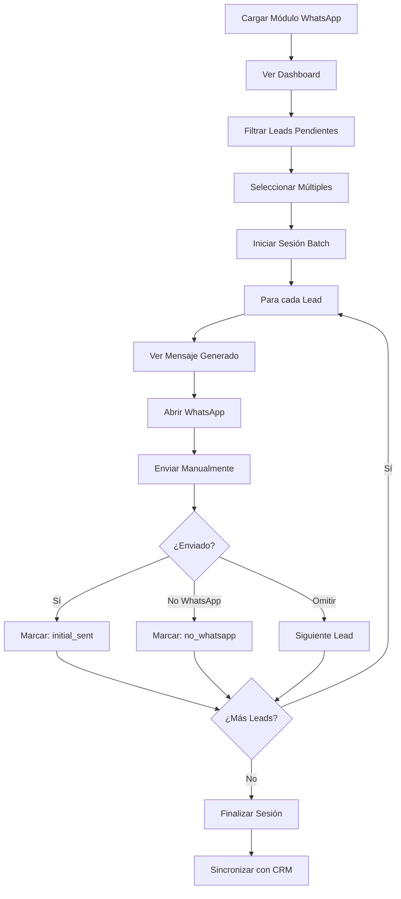
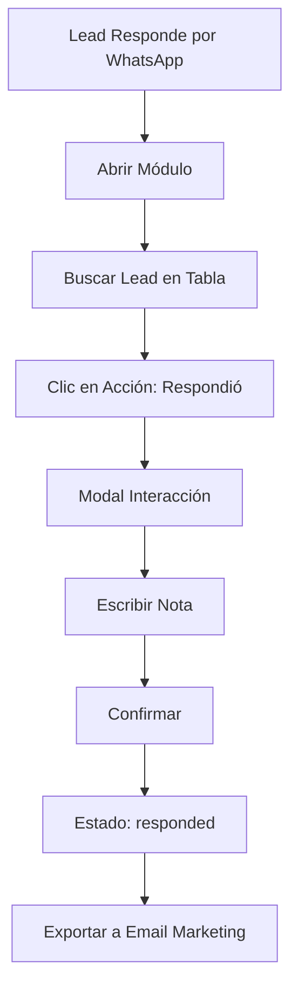
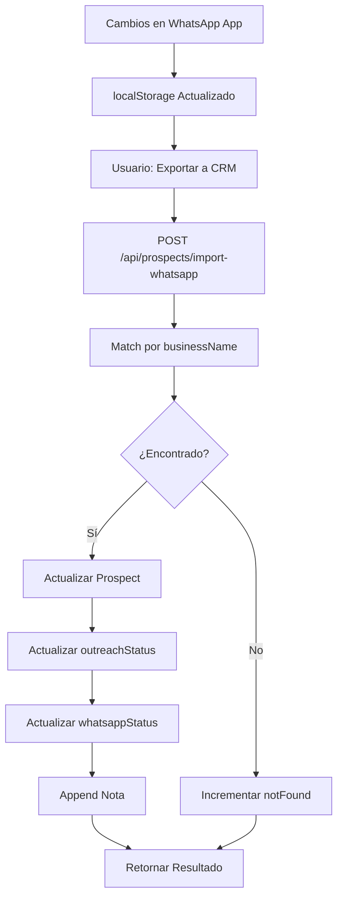

# Manual Técnico - Módulo WhatsApp

## 📋 Visión General

### Propósito
El módulo WhatsApp es una **aplicación nativa portada** diseñada para gestión local de contactos y campañas de WhatsApp. Funciona como un puente entre datos de prospección (Discovery) y acciones de outreach, permitiendo gestionar comunicaciones masivas de forma organizada y con persistencia local.

### Características Clave
- **Gestión local segura**: Todos los datos se almacenan en `localStorage` del navegador
- **Importación/Exportación**: Sincronización bidireccional con el módulo Prospects
- **Batch Processing**: Envío masivo de mensajes WhatsApp con control de estado
- **Email Bridge**: Exportación de contactos respondidos a herramientas de marketing
- **Backup/Restore**: Sistema de respaldos para prevenir pérdida de datos

---

## 🏗️ Arquitectura Técnica

### Estructura de Archivos

```
app/whatsapp/
├── page.tsx                          # Página principal (wrapper)
└── _components/
    ├── WhatsAppApp.tsx               # Componente principal (261 líneas)
    ├── types.ts                      # Definiciones TypeScript
    ├── data/
    │   └── initialData.ts            # CSV raw data embebido
    ├── utils/
    │   ├── csvParser.ts              # Parser CSV → Lead[]
    │   ├── nameParser.ts             # Extracción nombre/género
    │   └── messageGenerator.ts       # Generador de mensajes
    └── components/
        ├── LeadTable.tsx             # Tabla principal (12.5 KB)
        ├── WhatsAppGenerator.tsx     # Modal mensaje individual
        ├── BatchWhatsAppSender.tsx   # Sesión envío masivo (12.7 KB)
        ├── EmailExportView.tsx       # Vista exportación email
        ├── BackupManager.tsx         # Gestión backups
        ├── InteractionModal.tsx      # Registro interacciones
        └── EmailSimulator.tsx        # Simulador email marketing
```

### API Endpoints

#### `POST /api/prospects/import-whatsapp`
**Archivo**: `app/api/prospects/import-whatsapp/route.ts`

**Propósito**: Sincronizar estados de WhatsApp App → Prospects CRM

**Payload**:
```typescript
interface WhatsAppLead {
    id: string;
    nombreComercial: string;
    personaContacto: string;
    telefonoPrincipal: string;
    status: 'pending' | 'initial_sent' | 'responded' | 'not_interested' | 'converted' | 'contacted' | 'no_whatsapp';
    lastInteractionNote?: string;
}
```

**Lógica de Mapeo**:
| WhatsApp Status | CRM outreachStatus | CRM whatsappStatus |
|-----------------|--------------------|--------------------|
| `initial_sent` | `contacted` | `sent` |
| `responded` | `responded` | (sin cambio) |
| `not_interested` | `not_interested` | (sin cambio) |
| `converted` | `converted_to_lead` | (sin cambio) |
| `no_whatsapp` | (sin cambio) | `failed` |

**Proceso**:
1. Busca prospect por `businessName` (match exacto)
2. Actualiza `outreachStatus`, `whatsappStatus`, `whatsappSentAt`
3. Append nota de interacción a `notes`
4. Retorna: `{ updated, notFound, total }`

**Limitaciones Identificadas**:
- ⚠️ Match solo por nombre comercial (no por teléfono o ID)
- ⚠️ No maneja duplicados
- ⚠️ No valida formato de teléfono

---

## 📊 Modelo de Datos

### Fuente de Datos Inicial

**IMPORTANTE**: Los datos iniciales del módulo WhatsApp provienen de un **CSV embebido** en el código:

- **Archivo**: `app/whatsapp/_components/data/initialData.ts`
- **Contenido**: 182 hoteles/hostales de Loja, Ecuador
- **Formato**: String constante `CSV_RAW_DATA` con datos completos
- **Carga**: Se parsea automáticamente al abrir el módulo por primera vez
- **Persistencia**: Se guarda en `localStorage` como `whatsapp_module_leads`

> **Nota**: Este CSV es independiente de las tablas `prospects` y `discovery_leads` en Supabase. El módulo funciona completamente offline con estos datos embebidos.

### Interfaz `Lead`

```typescript
interface Lead {
    // Identificación
    id: string;                        // UUID generado
    nombreComercial: string;           // Nombre del negocio
    razonSocial: string;               // Razón social legal
    
    // Clasificación
    actividad: string;                 // Giro de negocio
    clasificacion: string;             // Categoría principal
    categoria: string;                 // Subcategoría
    
    // Ubicación
    provincia: string;
    canton: string;
    parroquia: string;
    
    // Contacto
    telefonoPrincipal: string;         // Teléfono principal
    telefonoSecundario: string;        // Teléfono alternativo
    email: string;                     // Email principal
    web: string;                       // Sitio web
    personaContacto: string;           // Nombre del contacto
    emailContacto: string;             // Email del contacto
    
    // Estado
    estado: string;                    // Estado original del CSV
    status: 'pending' | 'initial_sent' | 'responded' | 'not_interested' | 'converted' | 'contacted' | 'no_whatsapp';
    
    // Sincronización
    emailSynced?: boolean;             // Exportado a marketing
    lastInteractionNote?: string;      // Notas de interacción
}
```

### Persistencia

**LocalStorage Key**: `whatsapp_module_leads`

**Estrategia**:
1. **Carga inicial**: Intenta cargar de `localStorage`
2. **Fallback legacy**: Busca key antigua `turismo_crm_leads`
3. **Fallback CSV**: Si no hay datos, parsea `CSV_RAW_DATA`
4. **Auto-save**: Cada cambio en `leads` dispara `localStorage.setItem()`

**Ventajas**:
- ✅ Persistencia sin backend
- ✅ Funciona offline
- ✅ Rápido (sin latencia de red)

**Desventajas**:
- ⚠️ Límite ~5-10 MB por dominio
- ⚠️ No sincroniza entre dispositivos
- ⚠️ Vulnerable a limpieza de navegador

---

## 🎨 Componentes Principales

### 1. **WhatsAppApp.tsx** (Componente Raíz)

**Responsabilidades**:
- Gestión de estado global (`leads`, `selectedIds`, `currentView`)
- Persistencia en `localStorage`
- Orquestación de modales y vistas
- Cálculo de estadísticas

**Estados Clave**:
```typescript
const [leads, setLeads] = useState<Lead[]>([]);
const [selectedIds, setSelectedIds] = useState<Set<string>>(new Set());
const [isBatchMode, setIsBatchMode] = useState(false);
const [currentView, setCurrentView] = useState<'dashboard' | 'email'>('dashboard');
```

**Funciones Principales**:
- `handleUpdateStatus(id, newStatus, note)`: Actualiza estado de un lead
- `handleMarkSynced(ids)`: Marca leads como sincronizados con email
- `handleRestoreBackup(restoredLeads)`: Restaura desde backup
- `handleResetData()`: Resetea a CSV original
- `startBatchSession()`: Inicia modo envío masivo

**Estadísticas Calculadas**:
```typescript
const stats = {
    total: leads.length,
    pending: leads.filter(l => l.status === 'pending').length,
    contacted: leads.filter(l => l.status === 'initial_sent').length,
    responded: leads.filter(l => l.status === 'responded').length,
    notInterested: leads.filter(l => l.status === 'not_interested').length,
};
```

---

### 2. **LeadTable.tsx** (Tabla Principal)

**Tamaño**: 12,588 bytes

**Funcionalidades**:
- Visualización tabular de todos los leads
- Selección múltiple (checkboxes)
- Filtros por estado
- Búsqueda por nombre/teléfono
- Acciones rápidas por fila

**Props**:
```typescript
interface LeadTableProps {
    leads: Lead[];
    selectedIds: Set<string>;
    onToggleSelect: (id: string) => void;
    onSelectMultiple: (ids: string[]) => void;
    onLeadAction: (lead: Lead) => void;
    onOpenInteraction: (lead: Lead, type: Lead['status']) => void;
}
```

**Columnas Visibles**:
1. Checkbox (selección)
2. Nombre Comercial
3. Persona Contacto
4. Teléfono Principal
5. Actividad
6. Provincia
7. Estado (badge con color)
8. Acciones (botones)

**Filtros Implementados**:
- Por estado: Todos | Pendientes | Contactados | Respondidos | No Interesados
- Por texto: Búsqueda en nombre y teléfono

**Mejoras Potenciales**:
- [ ] Paginación (actualmente muestra todos)
- [ ] Ordenamiento por columna
- [ ] Exportación a CSV/Excel
- [ ] Filtros avanzados (provincia, actividad)

---

### 3. **BatchWhatsAppSender.tsx** (Envío Masivo)

**Tamaño**: 12,689 bytes

**Propósito**: Modal para sesiones de envío masivo de WhatsApp.

**Flujo de Trabajo**:
1. Usuario selecciona leads en tabla
2. Hace clic en "Iniciar Sesión (N)"
3. Se abre modal con lista de leads seleccionados
4. Para cada lead:
   - Muestra datos del contacto
   - Genera mensaje personalizado
   - Botón "Abrir WhatsApp" → `window.open('https://wa.me/...')`
   - Usuario envía mensaje manualmente
   - Marca estado: Enviado | No WhatsApp | Omitir

**Estados Posibles**:
- `initial_sent`: Mensaje enviado exitosamente
- `no_whatsapp`: Número no tiene WhatsApp
- `pending`: Omitido (sin cambio)

**Características**:
- ✅ Navegación secuencial (lead por lead)
- ✅ Contador de progreso
- ✅ Generación automática de mensaje
- ✅ Apertura directa de WhatsApp Web
- ✅ Registro de estado al finalizar

**Limitaciones**:
- ⚠️ Requiere intervención manual (no automatizado)
- ⚠️ No valida si el número es válido antes de abrir
- ⚠️ No guarda timestamp de envío

---

### 4. **WhatsAppGenerator.tsx** (Mensaje Individual)

**Tamaño**: 7,075 bytes

**Propósito**: Modal para generar y enviar mensaje a un solo lead.

**Funcionalidades**:
- Vista previa del mensaje personalizado
- Edición manual del mensaje
- Botón "Copiar Mensaje"
- Botón "Abrir WhatsApp"
- Registro de interacción

**Generación de Mensaje**:
Utiliza `messageGenerator.ts` que:
1. Parsea nombre del contacto (`nameParser.ts`)
2. Detecta género (M/F)
3. Genera saludo personalizado
4. Inserta nombre del negocio
5. Aplica template predefinido

**Ejemplo de Mensaje**:
```
Hola Juan, ¿cómo estás?

Te escribo de Objetivo Turismo. Vimos que tienes [Nombre Comercial] y nos gustaría ofrecerte...

¿Tienes 5 minutos para una llamada?
```

**Mejoras Potenciales**:
- [ ] Templates múltiples (seleccionables)
- [ ] Variables dinámicas (provincia, actividad)
- [ ] Historial de mensajes enviados
- [ ] A/B testing de mensajes

---

### 5. **EmailExportView.tsx** (Puente Marketing)

**Tamaño**: 4,681 bytes

**Propósito**: Exportar leads respondidos a herramientas de email marketing.

**Vista**: `currentView === 'email'`

**Funcionalidades**:
- Filtra leads con `status === 'responded'`
- Muestra lista de emails para exportar
- Botón "Marcar como Sincronizado"
- Simulador de integración con Mailchimp/SendGrid

**Flujo**:
1. Usuario va a "Puente Marketing"
2. Ve lista de leads que respondieron
3. Copia emails o usa botón de exportación
4. Marca como `emailSynced: true`

**Formato de Exportación**:
```csv
Email,Nombre,Negocio,Teléfono
contacto@example.com,Juan Pérez,Hotel XYZ,0999123456
```

**Integraciones Potenciales**:
- [ ] API Mailchimp
- [ ] API SendGrid
- [ ] API ActiveCampaign
- [ ] Webhook genérico

---

### 6. **BackupManager.tsx** (Gestión de Backups)

**Tamaño**: 3,431 bytes

**Propósito**: Crear y restaurar backups de la base de datos local.

**Funcionalidades**:
- **Crear Backup**: Descarga JSON con todos los leads
- **Restaurar Backup**: Sube JSON y restaura datos
- **Validación**: Verifica estructura antes de restaurar

**Formato de Backup**:
```json
{
  "timestamp": "2025-12-25T17:00:00.000Z",
  "version": "1.0",
  "leads": [...]
}
```

**Ubicación en UI**: Sidebar, sección "Gestión de Datos"

**Mejoras Potenciales**:
- [ ] Backups automáticos periódicos
- [ ] Sincronización con cloud (Google Drive, Dropbox)
- [ ] Versionado de backups
- [ ] Diff entre backup y estado actual

---

### 7. **InteractionModal.tsx** (Registro de Interacciones)

**Tamaño**: 3,127 bytes

**Propósito**: Capturar notas detalladas sobre interacciones.

**Trigger**: Al marcar un lead como:
- `responded`
- `not_interested`
- `converted`

**Campos**:
- Tipo de interacción (automático)
- Nota de texto libre
- Botones: Cancelar | Confirmar

**Ejemplo de Uso**:
1. Usuario marca lead como "No Interesado"
2. Se abre modal
3. Usuario escribe: "Ya tiene proveedor, no cambiar en 6 meses"
4. Se guarda en `lastInteractionNote`

**Integración con CRM**:
Cuando se sincroniza con `/api/prospects/import-whatsapp`, la nota se append a `prospects.notes`:
```
Notas existentes...

WhatsApp: Ya tiene proveedor, no cambiar en 6 meses
```

---

## 🔄 Flujos de Trabajo Principales

### Flujo 1: Campaña de Outreach Masivo



### Flujo 2: Seguimiento de Respuestas



### Flujo 3: Sincronización con CRM



---

## 🔌 Integración con Otros Módulos

### Con **Prospects**

**Dirección**: Bidireccional

**Exportación** (WhatsApp → Prospects):
- Endpoint: `POST /api/prospects/import-whatsapp`
- Datos: Estados de contacto, notas de interacción
- Frecuencia: Manual (botón "Sincronizar")

**Importación** (Prospects → WhatsApp):
- Método: CSV embebido en `initialData.ts`
- Proceso: Parseo manual, no automático
- Limitación: No hay endpoint para importar desde Prospects

**Mejora Sugerida**:
```typescript
// Nuevo endpoint
GET /api/prospects/export-whatsapp
// Retorna: Lead[] en formato WhatsApp
```

### Con **Discovery**

**Relación**: Indirecta (vía Prospects)

**Flujo**:
1. Discovery genera leads
2. Leads se convierten en Prospects
3. Prospects se exportan a CSV
4. CSV se embebe en WhatsApp App

**Oportunidad de Mejora**:
- [ ] Sincronización directa Discovery → WhatsApp
- [ ] Filtro por fuente (Discovery vs manual)

### Con **Trainer**

**Relación**: Complementaria

**Uso Conjunto**:
- WhatsApp identifica leads interesados
- Trainer prepara llamadas de seguimiento
- Datos de interacción informan el pitch

**Integración Potencial**:
- [ ] Botón "Preparar Llamada" en WhatsApp
- [ ] Auto-crear sesión de Trainer para leads respondidos

---

## 📈 Métricas y Analytics

### Métricas Actuales

**Dashboard Stats**:
- Total de leads
- Pendientes
- Contactados
- Respondidos
- No Interesados

**Cálculo**: En tiempo real, filtrado de array

### Métricas Faltantes (Oportunidades)

1. **Tasa de Respuesta**:
   ```typescript
   const responseRate = (responded / contacted) * 100;
   ```

2. **Tasa de Conversión**:
   ```typescript
   const conversionRate = (converted / responded) * 100;
   ```

3. **Tiempo Promedio de Respuesta**:
   Requiere: `contactedAt`, `respondedAt` timestamps

4. **Leads por Provincia/Actividad**:
   Distribución geográfica y sectorial

5. **Efectividad de Mensajes**:
   A/B testing de templates

---

## 🛠️ Utilidades y Helpers

### `csvParser.ts`

**Función**: `parseCSV(rawData: string): Lead[]`

**Proceso**:
1. Split por líneas
2. Parsear headers
3. Para cada fila:
   - Mapear columnas a campos Lead
   - Generar UUID
   - Asignar `status: 'pending'`
   - Limpiar datos (trim, normalizar)

**Mapeo de Columnas**:
```typescript
{
  'Nombre Comercial': 'nombreComercial',
  'Actividad': 'actividad',
  'Teléfono Principal': 'telefonoPrincipal',
  // ... etc
}
```

### `nameParser.ts`

**Función**: `parseName(fullName: string): ParsedName`

**Lógica**:
1. Split por espacios
2. Detectar género por terminación:
   - Termina en 'a': Femenino
   - Termina en 'o': Masculino
   - Default: Masculino
3. Separar firstName / lastName

**Ejemplo**:
```typescript
parseName("María González")
// { firstName: "María", lastName: "González", gender: "F" }
```

### `messageGenerator.ts`

**Función**: `generateMessage(lead: Lead): string`

**Template**:
```
Hola {firstName}, ¿cómo estás?

Te escribo de Objetivo Turismo. Vimos que tienes {nombreComercial} en {provincia} y nos gustaría ofrecerte nuestros servicios de marketing digital especializado en turismo.

¿Tienes 5 minutos para una llamada rápida?

Saludos,
[Tu Nombre]
```

**Personalización**:
- Saludo según género
- Nombre del negocio
- Ubicación
- Actividad (opcional)

---

## 🚨 Limitaciones Conocidas

### Técnicas

1. **Límite de LocalStorage**:
   - Máximo ~5-10 MB
   - Con 1000 leads ≈ 500 KB
   - Límite teórico: ~10,000 leads

2. **Sin Sincronización Multi-Dispositivo**:
   - Datos solo en un navegador
   - No comparte entre desktop/mobile

3. **Validación de Teléfonos**:
   - No valida formato antes de abrir WhatsApp
   - No detecta números internacionales

4. **Match por Nombre**:
   - API de importación solo busca por `businessName`
   - Vulnerable a typos o variaciones

### Funcionales

1. **Envío Manual**:
   - No automatiza el envío real
   - Requiere clic manual en WhatsApp

2. **Sin Historial**:
   - No guarda mensajes enviados
   - No registra timestamps de envío

3. **Sin Reportes**:
   - No genera reportes descargables
   - No hay gráficas de tendencias

---

## 🔮 Roadmap de Mejoras

### Corto Plazo (1-2 semanas)

1. **Validación de Teléfonos**:
   ```typescript
   const isValidPhone = (phone: string) => /^\d{10}$/.test(phone);
   ```

2. **Timestamps de Envío**:
   ```typescript
   interface Lead {
     // ...
     contactedAt?: Date;
     respondedAt?: Date;
   }
   ```

3. **Paginación en Tabla**:
   - 50 leads por página
   - Navegación con botones

### Mediano Plazo (1 mes)

4. **Sincronización Automática**:
   - Webhook al cambiar estado
   - POST automático a `/api/prospects/import-whatsapp`

5. **Templates Múltiples**:
   - Selector de template
   - Editor de templates
   - Variables dinámicas

6. **Reportes Básicos**:
   - Gráfica de conversión
   - Exportación a PDF

### Largo Plazo (3 meses)

7. **Backend Completo**:
   - Migrar de localStorage a base de datos
   - API REST completa
   - Sincronización multi-dispositivo

8. **Automatización**:
   - Integración con WhatsApp Business API
   - Envío programado
   - Respuestas automáticas

9. **Analytics Avanzado**:
   - Dashboard de métricas
   - Segmentación avanzada
   - Predicción de conversión (ML)

---

## 🧪 Testing y Debugging

### Cómo Probar el Módulo

1. **Acceso**: Navegar a `/whatsapp`
2. **Datos Iniciales**: Se cargan automáticamente desde CSV
3. **Seleccionar Leads**: Checkbox en tabla
4. **Iniciar Sesión**: Botón "Iniciar Sesión (N)"
5. **Enviar Mensajes**: Abrir WhatsApp para cada lead
6. **Verificar Estado**: Revisar badges en tabla

### Debugging LocalStorage

**Ver Datos**:
```javascript
// En DevTools Console
JSON.parse(localStorage.getItem('whatsapp_module_leads'))
```

**Limpiar Datos**:
```javascript
localStorage.removeItem('whatsapp_module_leads')
// Luego refrescar página
```

**Exportar Datos**:
```javascript
const data = localStorage.getItem('whatsapp_module_leads');
const blob = new Blob([data], { type: 'application/json' });
const url = URL.createObjectURL(blob);
const a = document.createElement('a');
a.href = url;
a.download = 'whatsapp_backup.json';
a.click();
```

### Logs Importantes

**En `WhatsAppApp.tsx`**:
```typescript
console.log('Leads loaded:', leads.length);
console.log('Selected IDs:', Array.from(selectedIds));
```

**En API**:
```typescript
console.log('Import request:', whatsappLeads.length, 'leads');
console.log('Updated:', updatedCount, 'Not found:', notFoundCount);
```

---

## 📚 Preguntas Frecuentes

**P: ¿Los datos se pierden al cerrar el navegador?**  
R: No, se guardan en `localStorage` y persisten entre sesiones.

**P: ¿Puedo usar esto en otro dispositivo?**  
R: No, los datos son locales al navegador. Usa Backup/Restore para transferir.

**P: ¿Cómo sincronizo con el CRM principal?**  
R: Usa el botón "Sincronizar con CRM" (pendiente de implementar en UI, pero API existe).

**P: ¿Puedo editar los mensajes antes de enviar?**  
R: Sí, en el modal de WhatsAppGenerator hay un textarea editable.

**P: ¿Qué pasa si un lead no tiene WhatsApp?**  
R: Márcalo como "No WhatsApp" y se actualizará el estado.

**P: ¿Puedo importar mi propia lista de contactos?**  
R: Actualmente no hay UI para esto. Requiere editar `initialData.ts` o usar Restore Backup.

---

## 🔗 Referencias Técnicas

### Archivos Clave

| Archivo | Líneas | Propósito |
|---------|--------|-----------|
| `WhatsAppApp.tsx` | 261 | Componente principal |
| `LeadTable.tsx` | ~400 | Tabla de leads |
| `BatchWhatsAppSender.tsx` | ~450 | Envío masivo |
| `route.ts` (import) | 86 | API de sincronización |

### Dependencias

- `react` - Framework UI
- `localStorage` - Persistencia
- `window.open()` - Apertura de WhatsApp Web

### Enlaces Útiles

- WhatsApp Web URL: `https://wa.me/{phone}?text={message}`
- Formato de teléfono: Sin espacios, sin guiones, con código país

---

**Última actualización**: Diciembre 2025  
**Versión del manual**: 1.0  
**Autor**: Documentación Técnica CRM
