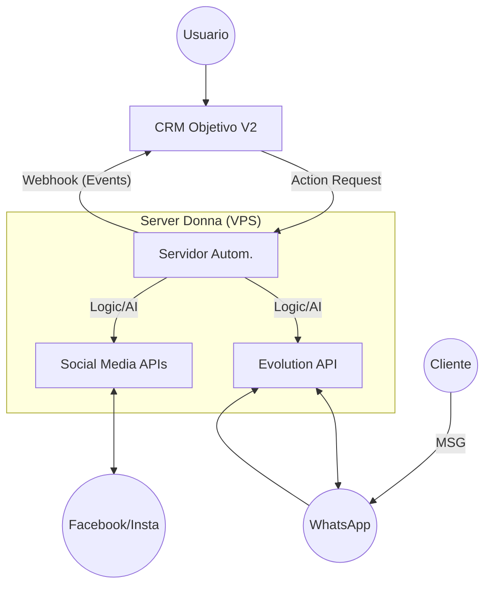

# Expediente Donna: Arquitecto de Automatización & Visión

Este documento unifica la visión estratégica y la planificación técnica para "Donna", el agente de automatización del CRM Objetivo.

## 1. Concepto y Visión
**"La Secretaria que se anticipa."**
Donna no es solo un chatbot; es una **Gerente de Operaciones basada en IA**. Su objetivo es liberar al usuario de la carga mental administrativa.
> *"Yo no quiero revisar leads, quiero saber con quién cerrar hoy."*

### Funcionalidades Core (Visión)
1.  **Gestión de Agenda Proactiva:** Bloqueo de tiempos de preparación, reprogramación inteligente.
2.  **Orquestación de Agentes:** Coordina agentes especializados (Investigación, Seguimiento, Limpieza).
3.  **Morning Briefing:** Reporte diario de decisiones ("3 clientes calientes", "5 borradores listos"), no solo datos.

---

## 2. Arquitectura del Sistema

El sistema funcionará con un modelo híbrido:
1.  **Cerebro Central (CRM):** Almacena datos, reglas de negocio, y estado de los leads.
2.  **Sistema Nervioso (Donna/n8n):** Ejecuta acciones, escucha eventos externos, y procesa lenguaje natural.
3.  **Extremidades (Evolution API/Socials):** Interactúan con el mundo exterior.

## 3. Estado Actual (Lo que ya tenemos)

### ✅ CRM Core
*   **Base de Datos Supabase:** Estructura sólida para `leads`, `clients`, `interactions`.
    *   *Nota:* La tabla `interactions` ya soporta `type`, `direction`, `content`, `outcome`, `duration`. Ideal para logging.
*   **Módulo Discovery:**
    *   Integración Gemini Flash + Tavily operativa.
    *   Capacidad de investigar leads y convertirlos a prospectos.
*   **Módulo Trainer/Coach:**
    *   Estructura base creada.
    *   Lógica de diagnóstico psicológico (Reptil/Emocional) en desarrollo.

## 4. Hoja de Ruta (Roadmap)

### FASE 1: Conexión Nerviosa (Integración Básica)
- [ ] **Seguridad:** Crear `DONNA_API_KEY` para comunicación segura Server <-> CRM.
- [ ] **Webhook Receptor (CRM):** Endpoint `/api/webhooks/donna/incoming` para recibir mensajes.
- [ ] **Webhook Emisor (CRM):** Función centralizada `sendToDonna(action, payload)` que dispare webhooks a n8n.

### FASE 2: La Voz de Donna (Whatsapp)
- [ ] **Flujo de Recepción:** n8n recibe mensaje -> Busca Lead en CRM -> Registra interacción.
- [ ] **Flujo de Respuesta:** Donna decide si responder sola (IA) o escalar a humano.

### FASE 3: Community Manager (Redes Sociales)
- [ ] **Generador de Contenido:** UI en CRM para dar "briefing" a Donna.
- [ ] **Publicador Automático:** n8n recibe briefing -> Genera copy/imagen -> Pide aprobación -> Publica.

## 📝 Notas del Arquitecto
1.  **No reinventar la rueda:** Usar `interactions` para todo el historial de chat.
2.  **Single Source of Truth:** El CRM manda. Si Donna detecta datos nuevos, actualiza el CRM.
3.  **Idempotencia:** Asegurar que reintentos de n8n no dupliquen interacciones.

---
*Fusión de `VISION_DONNA.md` y Expediente Técnico - 21 Diciembre 2024*
